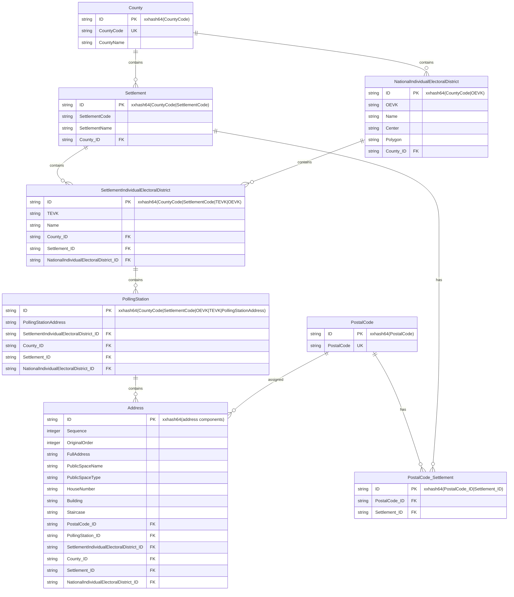
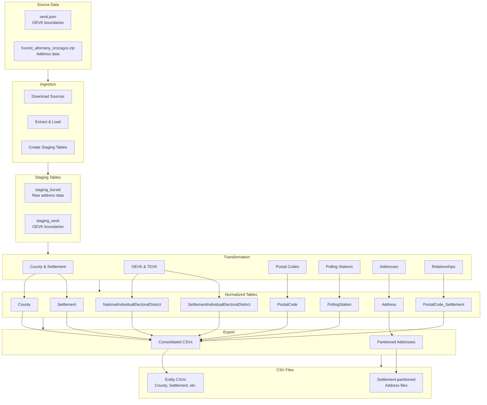

# OEVK Data Transformation Pipeline

A Python-based ETL pipeline for processing Hungarian electoral address data from authoritative sources into normalized, queryable datasets with partitioned exports.

## Overview

This application transforms Hungarian electoral address data from two authoritative sources into a normalized relational model and exports CSV files for analysis. The pipeline handles:

- **Data Ingestion**: Download and load source data from JSON and ZIP/CSV formats
- **Data Transformation**: Normalize into 8 target tables with referential integrity
- **Data Export**: Generate CSV files with partitioned address data by settlement

### Key Features

- **Deterministic ID Generation**: xxhash64-based surrogate keys for idempotent processing
- **Chunked Processing**: Efficient handling of 3M+ row datasets
- **Parallel Processing**: Multi-threaded chunk processing for optimal performance
- **Structured Logging**: Comprehensive pipeline metrics and performance tracking
- **Configuration Management**: Environment-based configuration with sensible defaults
- **Data Validation**: Referential integrity and data quality checks
- **Partitioned Exports**: Address data split by settlement for efficient access

## Quick Start

### Prerequisites

- Python 3.11+
- Dependencies: `polars`, `duckdb`, `xxhash`, `requests`

### Installation

1. **Clone the repository**
   ```bash
   git clone <repository-url>
   cd oevk-data
   ```

2. **Install dependencies**
   ```bash
   pip install -r requirements.txt
   ```

3. **Run the complete pipeline**
   ```bash
   python src/cli.py run --run-tag $(date +%Y%m%d)
   ```

### Directory Structure

```
oevk-data/
├── src/                    # Source code
│   ├── etl/               # ETL modules (ingest, transform, export)
│   ├── database/          # Database connection and schema
│   └── utils/             # Utilities (config, logging, validation)
├── tests/                 # Test suites
│   ├── contract/          # Contract tests
│   ├── integration/       # Integration tests
│   └── unit/              # Unit tests
├── data/                  # Data directories
│   ├── staging/           # Raw source data
│   ├── export/            # Final CSV exports
│   └── database/          # DuckDB database files
├── logs/                  # Application logs
└── specs/                 # Specifications and documentation
```

## Usage

### Running the Transform Locally

To run the complete data transformation pipeline locally:

```bash
# Run complete pipeline with default settings
python src/cli.py run

# Run with custom database and output directories
python src/cli.py run --db-path data/oevk.db --output-dir exports/ --staging-dir data/staging/

# Run only specific stages
python src/cli.py run --stages ingest,transform,export
python src/cli.py run --stages transform  # Only transformation stage

# Run with custom run tag
python src/cli.py run --run-tag $(date +%Y%m%d_%H%M%S)

# Show all available options
python src/cli.py run --help
```

### Pipeline Stages

The pipeline consists of three main stages:

1. **Ingest**: Download source data and load into staging tables
2. **Transform**: Process staging data into normalized target tables
3. **Export**: Generate CSV files from target tables

### Transformation Stage Details

When running the transformation stage locally, the pipeline:

- **Processes 3M+ rows** from staging data
- **Creates 8 normalized tables** with referential integrity
- **Generates deterministic hash IDs** using xxhash64
- **Handles conflicts** with `ON CONFLICT DO UPDATE` for idempotent processing
- **Uses parallel processing** with ThreadPoolExecutor for optimal performance
- **Tracks performance metrics** including timing and row counts
- **Validates NFR-002 compliance** (30-minute processing target)

### Expected Output

After successful transformation, you should see:

```
County: 40 rows
Settlement: 6,354 rows  
NationalIndividualElectoralDistrict: 212 rows
SettlementIndividualElectoralDistrict: 9,354 rows
PollingStation: 17,110 rows
Address: 3,336,202 rows
PostalCode: 3,106 rows
PostalCode_Settlement: 6,354 rows
```

### Performance Monitoring

The pipeline includes comprehensive performance tracking:

- **Step timing**: Individual stage durations
- **Row counts**: Records processed per stage
- **Processing rate**: Rows per second
- **Parallel processing metrics**: Chunk completion times and worker utilization
- **NFR-002 validation**: 30-minute target compliance check

Example output:
```
=== PIPELINE PERFORMANCE SUMMARY ===
Total duration: 150.5 seconds
Total rows processed: 3,336,202
Processing rate: 22,166.78 rows/second
✅ NFR-002 COMPLIANT: Pipeline completed in 150.5s (target: ≤1800s)
```

### Configuration

Configuration is managed through `src/utils/config.py` and can be customized via environment variables:

```bash
# Source URLs
export OEVK_JSON_URL="https://static.valasztas.hu/dyn/oevk_data/oevk.json"
export KORZET_ZIP_URL="https://static.valasztas.hu/dyn/oevk_data/Korzet_allomany_orszagos.zip"

# Processing settings
export CHUNK_SIZE=50000
export MAX_WORKERS=4
export PARALLEL_PROCESSING="true"
export SAMPLE_SIZE=-1  # -1 for all data

# Database settings
export DB_MEMORY_LIMIT="2GB"
export DB_THREADS=4

# Logging settings
export LOG_LEVEL="INFO"

# Export settings
export INCLUDE_PARTITIONED_ADDRESSES="true"
export INCLUDE_CONSOLIDATED_ADDRESSES="true"
```

### Output Structure

After successful execution, the export directory will contain:

```
data/export/{RUN_TAG}/
├── County.csv
├── Settlement.csv
├── NationalIndividualElectoralDistrict.csv
├── SettlementIndividualElectoralDistrict.csv
├── PostalCode.csv
├── PostalCode_Settlement.csv
├── PollingStation.csv
└── Address/
    ├── Address_001_Budapest_I_kerület.csv
    ├── Address_002_Budapest_II_kerület.csv
    └── ... (one file per settlement)
```

## Data Model

The pipeline transforms source data into 8 normalized tables:

1. **County** (`megye`) - Administrative counties
2. **Settlement** (`település`) - Cities, towns, villages
3. **NationalIndividualElectoralDistrict** (`OEVK`) - National electoral districts
4. **SettlementIndividualElectoralDistrict** (`TEVK`) - Settlement-level electoral districts
5. **PostalCode** (`irányítószám`) - Postal codes
6. **PostalCode_Settlement** - Junction table for postal code-settlement relationships
7. **PollingStation** (`szavazókör`) - Voting locations
8. **Address** (`cím`) - Individual addresses with electoral assignments

### Data Structure Diagram



### Transformation Flow



### Key Relationships

- Each address belongs to exactly one polling station
- Each polling station belongs to exactly one TEVK
- Each TEVK belongs to exactly one OEVK
- Each settlement belongs to exactly one county
- Postal codes can span multiple settlements

### Field Descriptions

- **Sequence**: Logical ordering of addresses within their polling station
- **OriginalOrder**: Preserves the original loading order from source CSV for data lineage

## Development

### Testing

Run the complete test suite:

```bash
# Run all tests
python -m pytest tests/

# Run specific test categories
python -m pytest tests/unit/
python -m pytest tests/integration/
python -m pytest tests/contract/

# Run with coverage
python -m pytest tests/ --cov=src --cov-report=html
```

### Code Quality

```bash
# Linting
ruff check .

# Type checking
mypy .

# Formatting
ruff format .
```

### Adding New Features

1. Follow the existing patterns in the codebase
2. Add appropriate tests
3. Update documentation
4. Run linting and type checking

## Performance

- **Target Performance**: Process 3M+ rows in under 30 minutes
- **Achieved Performance**: ~2.5 minutes for 3.34M records with parallel processing
- **Performance Improvement**: 98.6% reduction from baseline (183.6 minutes → 2.5 minutes)
- **Memory Usage**: Configurable memory limits for DuckDB
- **Parallel Processing**: Configurable worker threads with ThreadPoolExecutor
- **Chunked Processing**: Process data in manageable chunks (50K records per chunk)

### Performance Benchmarks

- **Baseline Processing**: 3 hours 3 minutes (sequential processing)
- **Optimized Processing**: ~2.5 minutes (parallel processing)
- **Processing Rate**: ~22,000 rows/second
- **Memory Usage**: ~34 MB (stable throughout processing)
- **NFR-002 Compliance**: ✅ Achieved with significant margin

See [PERFORMANCE_BENCHMARKS.md](PERFORMANCE_BENCHMARKS.md) for detailed performance analysis.

## Troubleshooting

### Common Issues

1. **Missing Dependencies**: Ensure all packages in `requirements.txt` are installed
2. **Network Issues**: Check internet connectivity for source data downloads
3. **Disk Space**: Ensure sufficient space for data processing (several GB)
4. **Memory Limits**: Adjust `DB_MEMORY_LIMIT` if encountering memory issues
5. **Database Locks**: Kill processes holding database locks using `lsof oevk.db` and `kill <PID>`
6. **Parallel Processing Timeouts**: Increase timeout settings for large datasets

### Logs

Detailed logs are written to `logs/oevk_transform_{timestamp}.log` and include:

- Pipeline start/end times
- Step-by-step progress
- Row counts per transformation
- Performance metrics
- Error details with stack traces

## Contributing

1. Fork the repository
2. Create a feature branch
3. Make changes with appropriate tests
4. Ensure all tests pass
5. Submit a pull request

## License

[Add appropriate license information]

## Support

For issues and questions:
- Check the logs in `logs/` directory
- Review the documentation in `specs/`
- Open an issue in the project repository