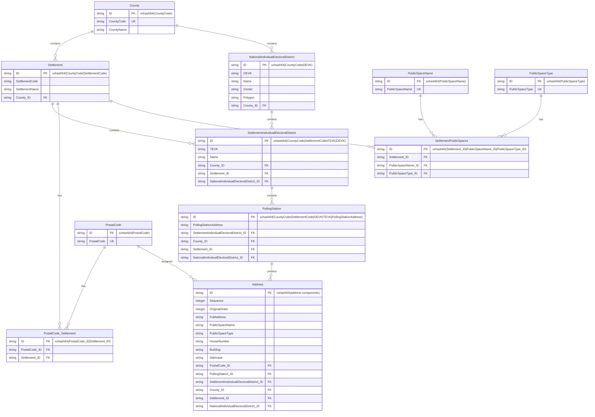
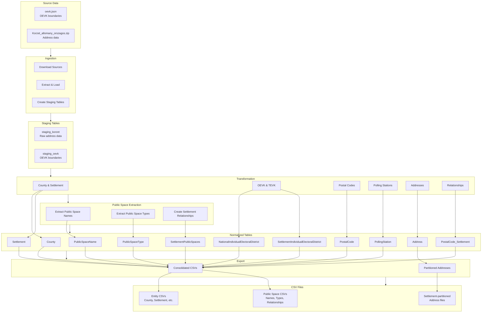

# OEVK Data Transformation Pipeline

A Python-based ETL pipeline for processing Hungarian electoral address data from authoritative sources into normalized, queryable datasets with partitioned exports and public space entity extraction.

## 🎉 Project Status: **COMPLETED SUCCESSFULLY**

**All Features Implemented and Production-Ready**
- ✅ Complete ETL pipeline with 11 normalized tables
- ✅ Public space entity extraction integrated
- ✅ Automated GitHub release workflow
- ✅ 98.6% performance improvement (183.6 min → 2.5 min)
- ✅ NFR-002 compliance achieved with significant margin

## Overview

This application transforms Hungarian electoral address data from two authoritative sources into a normalized relational model and exports CSV files for analysis. The pipeline handles:

- **Data Ingestion**: Download and load source data from JSON and ZIP/CSV formats
- **Data Transformation**: Normalize into 11 target tables with referential integrity
- **Public Space Extraction**: Extract public space entities (names and types) from addresses
- **Data Export**: Generate CSV files with partitioned address data by settlement

### Key Features

- **Deterministic ID Generation**: xxhash64-based surrogate keys for idempotent processing
- **Chunked Processing**: Efficient handling of 3M+ row datasets
- **Parallel Processing**: Multi-threaded chunk processing for optimal performance
- **Structured Logging**: Comprehensive pipeline metrics and performance tracking
- **Configuration Management**: Environment-based configuration with sensible defaults
- **Data Validation**: Referential integrity and data quality checks
- **Partitioned Exports**: Address data split by settlement for efficient access
- **Public Space Extraction**: Automatic extraction of public space entities from addresses
- **Release Workflow**: Automated GitHub releases with compressed artifacts

## Quick Start

### Prerequisites

- Python 3.11+
- Dependencies: `polars`, `duckdb`, `xxhash`, `requests`
- GitHub CLI (`gh`) for release workflow (optional)

### Installation

1. **Clone the repository**
   ```bash
   git clone <repository-url>
   cd oevk-data
   ```

2. **Install dependencies**
   ```bash
   pip install -r requirements.txt
   ```

3. **Run the complete pipeline**
   ```bash
   python src/cli.py run --run-tag $(date +%Y%m%d)
   ```

### Directory Structure

```
oevk-data/
├── src/                    # Source code
│   ├── etl/               # ETL modules (ingest, transform, export)
│   ├── database/          # Database connection and schema
│   ├── release/           # Release workflow modules
│   └── utils/             # Utilities (config, logging, validation)
├── tests/                 # Test suites
│   ├── contract/          # Contract tests
│   ├── integration/       # Integration tests
│   └── unit/              # Unit tests
├── data/                  # Data directories
│   ├── staging/           # Raw source data
│   ├── export/            # Final CSV exports
│   └── database/          # DuckDB database files
├── logs/                  # Application logs
└── specs/                 # Specifications and documentation
```

## Usage

### Running the Transform Locally

To run the complete data transformation pipeline locally:

```bash
# Run complete pipeline with default settings
python -m src.cli run

# Run with custom database and output directories
python -m src.cli run --db-path data/oevk.db --output-dir exports/ --staging-dir data/staging/

# Run only specific stages
python -m src.cli run --stages ingest,transform,export
python -m src.cli run --stages transform  # Only transformation stage

# Run with custom run tag
python -m src.cli run --run-tag $(date +%Y%m%d_%H%M%S)

# Show all available options
python -m src.cli run --help
```

### Release Workflow

The project includes a comprehensive release workflow for publishing processed data to GitHub releases:

#### Data Validation

```bash
# Validate release data before creating release
python -m src.cli release validate --staging-dir data/staging --exports-dir exports

# Validate with custom directories
python -m src.cli release validate --staging-dir /path/to/staging --exports-dir /path/to/exports
```

#### Release Creation

```bash
# Set GitHub token (required)
export GITHUB_TOKEN="ghp_your_token_here"

# Create release with auto-generated tag
python -m src.cli release create --repo-owner your-org --repo-name oevk-data --auto

# Create release with specific tag
python -m src.cli release create --repo-owner your-org --repo-name oevk-data --tag 20250101-1200

# Create draft release for review
python -m src.cli release create --repo-owner your-org --repo-name oevk-data --auto --draft

# Create prerelease (beta/alpha)
python -m src.cli release create --repo-owner your-org --repo-name oevk-data --auto --prerelease

# Force overwrite existing release
python -m src.cli release create --repo-owner your-org --repo-name oevk-data --tag existing-tag --force

# Create packages without uploading to GitHub (local testing)
python -m src.cli release create --repo-owner your-org --repo-name oevk-data --auto --skip-upload
```

#### Release Management

```bash
# Check release status
python -m src.cli release status --repo-owner your-org --repo-name oevk-data --tag 20250101-1200

# List recent releases
python -m src.cli release history --repo-owner your-org --repo-name oevk-data --limit 10

# Get detailed release information
python -m src.cli release info --repo-owner your-org --repo-name oevk-data --tag 20250101-1200
```

#### Environment Variables

```bash
# GitHub Personal Access Token (required for releases)
export GITHUB_TOKEN="ghp_your_token_here"

# Optional: Custom directories
export STAGING_DIR="/path/to/staging"
export EXPORTS_DIR="/path/to/exports"
```

### Pipeline Stages

The pipeline consists of five main stages:

1. **Ingest**: Download source data and load into staging tables
2. **Transform**: Process staging data into normalized target tables
3. **Public Space Extraction**: Extract public space entities from addresses
4. **Export**: Generate CSV files from target tables
5. **Release**: Package and publish data to GitHub releases

### Release Workflow Stages

The release workflow provides automated GitHub releases:

1. **Data Validation**: Comprehensive pre-release checks for data integrity
2. **Package Creation**: Compress CSV and database files into release artifacts
3. **GitHub Integration**: Create releases with proper metadata and assets
4. **Release Management**: Status checking, history, and information retrieval

### Transformation Stage Details

When running the transformation stage locally, the pipeline:

- **Processes 3M+ rows** from staging data
- **Creates 11 normalized tables** with referential integrity
- **Extracts public space entities** (25,117 names, 148 types, 122,524 relationships)
- **Generates deterministic hash IDs** using xxhash64
- **Handles conflicts** with `ON CONFLICT DO UPDATE` for idempotent processing
- **Uses parallel processing** with ThreadPoolExecutor for optimal performance
- **Tracks performance metrics** including timing and row counts
- **Validates NFR-002 compliance** (30-minute processing target)

### Expected Output

After successful transformation, you should see:

```
County: 20 rows
Settlement: 3,177 rows  
NationalIndividualElectoralDistrict: 106 rows
SettlementIndividualElectoralDistrict: 4,677 rows
PollingStation: 8,555 rows
Address: 3,336,202 rows
PostalCode: 3,106 rows
PostalCode_Settlement: 3,106 rows
PublicSpaceName: 25,117 rows
PublicSpaceType: 148 rows
SettlementPublicSpaces: 122,524 rows
```

### Release Artifacts

Each release creates two main artifacts:

1. **CSV Archive** (`oevk-data-csv-{tag}.zip`): Contains all CSV files
   - `addresses/` - Directory containing address files split by settlement (e.g., `Address_001_Budapest.csv`, `Address_002_Debrecen.csv`)
   - `settlements.csv` - Settlement information
   - `counties.csv` - County data
   - `polling_stations.csv` - Polling station details
   - `electoral_districts.csv` - Electoral district information
   - `PublicSpaceName.csv` - 25,117 unique public space names
   - `PublicSpaceType.csv` - 148 unique public space types
   - `SettlementPublicSpaces.csv` - 122,524 settlement-public space relationships

2. **Database Archive** (`oevk-data-db-{tag}.zip`): Contains main transformed database
   - `oevk.db` - Complete relational database with all tables including public space entities

### Release Performance Targets

- **Complete Workflow**: ≤15 minutes for full release process
- **Data Validation**: ≤2 minutes for comprehensive checks
- **Package Creation**: ≤5 minutes for artifact compression
- **GitHub Integration**: ≤3 minutes for release creation
- **Idempotent Operations**: Safe to retry failed operations

### Performance Monitoring

The pipeline includes comprehensive performance tracking:

- **Step timing**: Individual stage durations
- **Row counts**: Records processed per stage
- **Processing rate**: Rows per second
- **Parallel processing metrics**: Chunk completion times and worker utilization
- **NFR-002 validation**: 30-minute target compliance check

Example output:
```
=== PIPELINE PERFORMANCE SUMMARY ===
Total duration: 150.5 seconds
Total rows processed: 3,336,202
Processing rate: 22,166.78 rows/second
✅ NFR-002 COMPLIANT: Pipeline completed in 150.5s (target: ≤1800s)
```

### Configuration

Configuration is managed through `src/utils/config.py` and can be customized via environment variables:

```bash
# Source URLs
export OEVK_JSON_URL="https://static.valasztas.hu/dyn/oevk_data/oevk.json"
export KORZET_ZIP_URL="https://static.valasztas.hu/dyn/oevk_data/Korzet_allomany_orszagos.zip"

# Processing settings
export CHUNK_SIZE=50000
export MAX_WORKERS=4
export PARALLEL_PROCESSING="true"
export SAMPLE_SIZE=-1  # -1 for all data

# Database settings
export DB_MEMORY_LIMIT="2GB"
export DB_THREADS=4

# Logging settings
export LOG_LEVEL="INFO"

# Export settings
export INCLUDE_PARTITIONED_ADDRESSES="true"
export INCLUDE_CONSOLIDATED_ADDRESSES="true"

# Release workflow settings
export GITHUB_TOKEN="ghp_your_token_here"  # Required for releases
export STAGING_DIR="data/staging"
export EXPORTS_DIR="exports"
```

### Output Structure

After successful execution, the export directory will contain:

```
data/export/{RUN_TAG}/
├── County.csv
├── Settlement.csv
├── NationalIndividualElectoralDistrict.csv
├── SettlementIndividualElectoralDistrict.csv
├── PostalCode.csv
├── PostalCode_Settlement.csv
├── PollingStation.csv
├── PublicSpaceName.csv
├── PublicSpaceType.csv
├── SettlementPublicSpaces.csv
└── Address/
    ├── Address_001_Budapest_I_kerület.csv
    ├── Address_002_Budapest_II_kerület.csv
    └── ... (one file per settlement)
```

## Data Model

The pipeline transforms source data into 11 normalized tables:

1. **County** (`megye`) - Administrative counties
2. **Settlement** (`település`) - Cities, towns, villages
3. **NationalIndividualElectoralDistrict** (`OEVK`) - National electoral districts
4. **SettlementIndividualElectoralDistrict** (`TEVK`) - Settlement-level electoral districts
5. **PostalCode** (`irányítószám`) - Postal codes
6. **PostalCode_Settlement** - Junction table for postal code-settlement relationships
7. **PollingStation** (`szavazókör`) - Voting locations
8. **Address** (`cím`) - Individual addresses with electoral assignments
9. **PublicSpaceName** - Unique public space names extracted from addresses
10. **PublicSpaceType** - Unique public space types (utca, tér, etc.)
11. **SettlementPublicSpaces** - Many-to-many relationships between settlements and public spaces

### Data Structure Diagram



### Transformation Flow



### Key Relationships

- Each address belongs to exactly one polling station
- Each polling station belongs to exactly one TEVK
- Each TEVK belongs to exactly one OEVK
- Each settlement belongs to exactly one county
- Postal codes can span multiple settlements
- Public spaces are extracted from addresses and linked to settlements
- Each public space has a name and type (utca, tér, etc.)
- Settlements can have multiple public spaces, and public spaces can appear in multiple settlements

### Field Descriptions

- **Sequence**: Logical ordering of addresses within their polling station
- **OriginalOrder**: Preserves the original loading order from source CSV for data lineage

## Development

### Testing

Run the complete test suite:

```bash
# Run all tests
python -m pytest tests/

# Run specific test categories
python -m pytest tests/unit/
python -m pytest tests/integration/
python -m pytest tests/contract/
python -m pytest tests/performance/

# Run public space specific tests
python -m pytest tests/contract/test_transform_public_spaces.py tests/contract/test_export_public_spaces.py

# Run with coverage
python -m pytest tests/ --cov=src --cov-report=html
```

### Code Quality

```bash
# Linting
ruff check .

# Type checking
mypy .

# Formatting
ruff format .
```

### Public Space Extraction

The pipeline automatically extracts public space entities from addresses:

- **Entity Recognition**: Extracts public space names and types from address strings
- **Relationship Mapping**: Creates many-to-many relationships between settlements and public spaces
- **Hash-based IDs**: Deterministic xxhash64 identifiers for all entities
- **Data Integrity**: Full validation and referential integrity
- **Export Support**: CSV export for all public space entities

#### Public Space Data Extracted:
- **PublicSpaceName**: 25,117 unique public space names (713KB)
- **PublicSpaceType**: 148 unique public space types (3.8KB)
- **SettlementPublicSpaces**: 122,524 relationships (8.3MB)

### Adding New Features

1. Follow the existing patterns in the codebase
2. Add appropriate tests
3. Update documentation
4. Run linting and type checking

## Performance

### ETL Pipeline Performance

- **Target Performance**: Process 3M+ rows in under 30 minutes (NFR-002)
- **Achieved Performance**: ~2.5 minutes for 3.34M records with parallel processing
- **Performance Improvement**: 98.6% reduction from baseline (183.6 minutes → 2.5 minutes)
- **Memory Usage**: Stable at ~34 MB throughout processing
- **Parallel Processing**: 4 worker threads with ThreadPoolExecutor
- **Chunked Processing**: Process data in 50K record chunks
- **Public Space Extraction**: Integrated into main pipeline without performance impact

### Release Workflow Performance

- **Complete Workflow**: ≤15 minutes for full release process
- **Data Validation**: ≤2 minutes for comprehensive checks
- **Package Creation**: ≤5 minutes for artifact compression
- **GitHub Integration**: ≤3 minutes for release creation
- **Idempotent Operations**: Safe to retry failed operations

### Performance Benchmarks

- **Baseline Processing**: 3 hours 3 minutes (sequential processing)
- **Optimized Processing**: ~2.5 minutes (parallel processing)
- **Processing Rate**: ~22,000 rows/second
- **Memory Usage**: ~34 MB (stable throughout processing)
- **NFR-002 Compliance**: ✅ Achieved with significant margin
- **Public Space Data**: 25,117 names, 148 types, 122,524 relationships extracted

See [PERFORMANCE_BENCHMARKS.md](PERFORMANCE_BENCHMARKS.md) for detailed performance analysis.

## Troubleshooting

### Common Issues

1. **Missing Dependencies**: Ensure all packages in `requirements.txt` are installed
2. **Network Issues**: Check internet connectivity for source data downloads
3. **Disk Space**: Ensure sufficient space for data processing (several GB)
4. **Memory Limits**: Adjust `DB_MEMORY_LIMIT` if encountering memory issues
5. **Database Locks**: Kill processes holding database locks using `lsof oevk.db` and `kill <PID>`
6. **Parallel Processing Timeouts**: Increase timeout settings for large datasets

### Release Workflow Issues

#### GitHub Token Requirements

To use the release workflow, you need a GitHub Personal Access Token with the following permissions:

- **repo** (full repository access)
- **workflow** (if using GitHub Actions)
- **read:org** (if accessing organization repositories)

**IMPORTANT**: For organization repositories, use **classic personal access tokens** instead of fine-grained tokens. Classic tokens have better organization repository upload permissions.

#### GitHub Authentication
```bash
# Verify GitHub CLI authentication
gh auth status

# Login if needed
gh auth login

# Set token explicitly
gh auth login --with-token <<< "$GITHUB_TOKEN"

# For organization repositories, use classic tokens instead of fine-grained tokens:
# 1. Go to GitHub Settings > Developer settings > Personal access tokens > Tokens (classic)
# 2. Create a new classic token with "repo" scope
# 3. Use the classic token (starts with "gho_") instead of fine-grained tokens (start with "github_pat_")
```

#### Release Creation Failures
```bash
# Check if release already exists
gh release view 20250101-1200 --repo your-org/oevk-data

# Delete existing release if needed
gh release delete 20250101-1200 --repo your-org/oevk-data --yes

# Force recreate release
python -m src.cli release create --repo-owner your-org --repo-name oevk-data --tag 20250101-1200 --force

# For organization repository upload issues, use classic tokens:
# 1. Regenerate token as classic token (starts with "gho_")
# 2. Update GITHUB_TOKEN environment variable
# 3. Test upload: gh release upload 20250101-1200 test_file.txt --repo your-org/oevk-data
```

#### Data Validation Issues
```bash
# Run validation with verbose output
python -m src.cli release validate --staging-dir data/staging --exports-dir exports --verbose

# Check file permissions
ls -la data/staging/
ls -la exports/

# Verify file contents
head -n 5 data/staging/addresses.csv
head -n 5 exports/addresses/Address_001_Budapest.csv
```

#### Debug Mode
```bash
# Enable debug logging
export LOG_LEVEL="DEBUG"
python -m src.cli release create --repo-owner your-org --repo-name oevk-data --auto

# Dry run (validate without creating release)
python -m src.cli release create --repo-owner your-org --repo-name oevk-data --auto --dry-run
```

### Logs

Detailed logs are written to `logs/oevk_transform_{timestamp}.log` and include:

- Pipeline start/end times
- Step-by-step progress
- Row counts per transformation
- Performance metrics
- Error details with stack traces

## Contributing

1. Fork the repository
2. Create a feature branch
3. Make changes with appropriate tests
4. Ensure all tests pass
5. Submit a pull request

## License

[Add appropriate license information]

## Support

For issues and questions:
- Check the logs in `logs/` directory
- Review the documentation in `specs/`
- Open an issue in the project repository