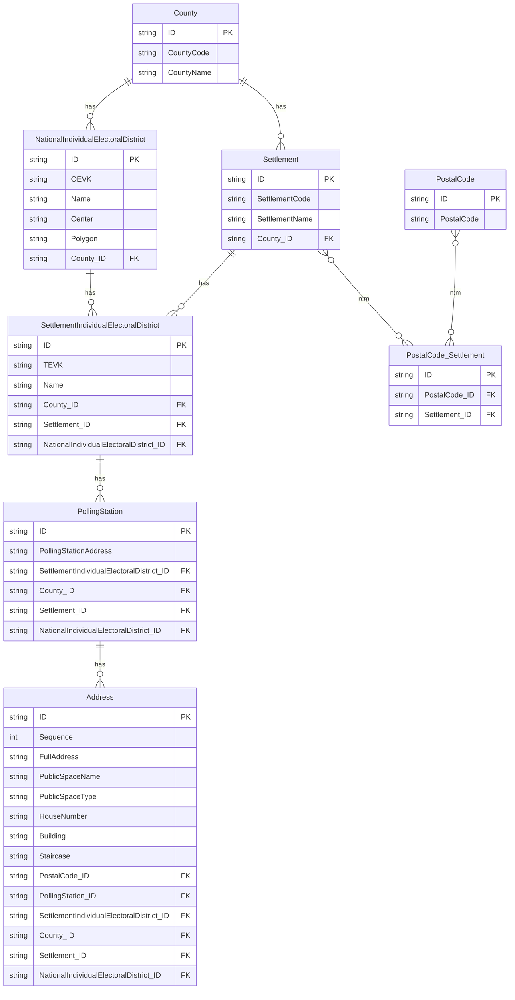
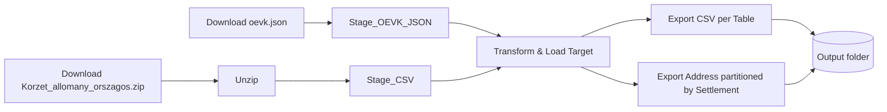
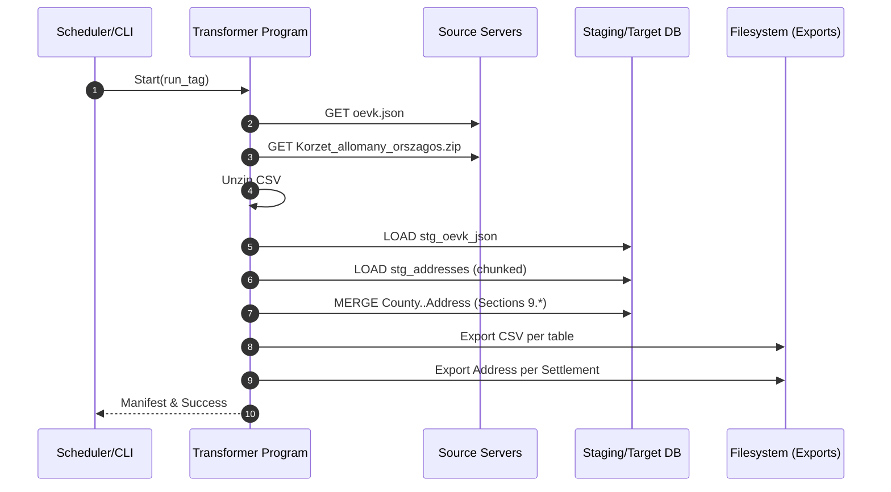

# OEVK Address Loader – Functional & Technical Specification
**Version:** 1.0
**Prepared:** 2025-09-28 00:03 (Europe/Budapest)
**Role:** Business Analyst / Data Engineer

---

## 1) Executive Summary

This specification defines a **transformer program** that downloads Hungarian electoral address data from two authoritative sources, loads them into a **staging database**, transforms the data into a **normalized target model**, and then **exports CSV files** for each target table. Additionally, the **Address** dataset must be exported **partitioned by Settlement** (one CSV per settlement).

**Sources**
- `oevk.json` (≈108 OEVKs): county-level OEVK geometry and centers.
- `Korzet_allomany_orszagos.zip` → single large CSV (>3M rows): address-to-polling-district coverage with TEVK/OEVK, postal codes, and polling station info.

**Outputs**
- CSV for each target table (`County`, `Settlement`, `NationalIndividualElectoralDistrict`, `SettlementIndividualElectoralDistrict`, `PostalCode`, `PostalCode_Settlement`, `PollingStation`).
- **Partitioned Address exports**: one CSV per `Settlement` (split address files), with no consolidated `Address.csv`.

**Key design choices**
- **Deterministic surrogate IDs** derived from stable business keys to ensure idempotency and reproducible joins.
- **Chunked / vectorized processing** (recommended: Polars or DuckDB) to handle 3M+ rows efficiently.
- **Strict normalization** per the provided logical model, with **derived field logic** for human-readable names.
- Robust **data-quality, logging, and restartability**.

---

## 2) Scope

### In-scope
- Automated download of both sources.
- Parsing (JSON + CSV with semicolon delimiters and UTF‑8).
- Staging loads with minimal type coercion.
- Transform to the target relational model shown here.
- CSV exports for all target tables except Address; **Address** split by `Settlement` only (no consolidated file).
- Idempotent reruns (safe to reprocess the same day’s files).
- Basic data validation and referential integrity checks.

### Out-of-scope
- Geospatial functions beyond storing polygon/point as text/WKT.
- UI or interactive browsing of the data.
- Near-real-time updates (batch process assumed).

---

## 3) Source Data

The address data will be structured based on the data found at

* [https://static.valasztas.hu/dyn/oevk_data/oevk.json](https://static.valasztas.hu/dyn/oevk_data/oevk.json) - 108 elements
* [https://static.valasztas.hu/dyn/oevk_data/Korzet_allomany_orszagos.zip](https://static.valasztas.hu/dyn/oevk_data/Korzet_allomany_orszagos.zip) - more than 3 million elements. A ZIP file containing 1 CSV file.

### 3.1 `oevk.json` (National OEVKs)
Each element contains:
- `maz` — County code (e.g., `"01"`)
- `evk` — OEVK code (e.g., `"01"`)
- `centrum` — `"lat lon"` (string)
- `poligon` — `"lat lon,lat lon,...“` (string)

### 3.2 `Korzet_allomany_orszagos.zip` → CSV
- Delimiter: `;` (semicolon)
- Quoting: `"` (double quotes)
- Encoding: UTF‑8 (diacritics present)
- Key columns (Hungarian → English):
  - **"Vármegye kód"** → CountyCode
  - **"Vármegye"** → CountyName
  - **"OEVK"** → OEVK
  - **"Település kód"** → SettlementCode
  - **"Település"** → SettlementName
  - **"TEVK"** → TEVK
  - **"Szavazókör"** → PollingStationCode (technical)
  - **"Szavazókör cím"** → PollingStationAddress
  - **"PIR"** → PostalCode
  - **"Közterület név"** → PublicSpaceName
  - **"Közterület jelleg"** → PublicSpaceType
  - **"Házszám"** → HouseNumber
  - **"Épület"** → Building
  - **"Lépcsőház"** → Staircase
  - **Additional flags ("Számlálásra kijelölt", "Akadálymentesített")** — ignored in target model but persisted in staging for auditability.

---

## 4) Target Logical Model

### 4.1 Entities & Attributes (from requirements)
- **County** (`ID` PK, `CountyCode`, `CountyName`)
- **Settlement** (`ID` PK, `SettlementCode`, `SettlementName`, `County_ID` FK)
- **NationalIndividualElectoralDistrict** (`ID` PK, `OEVK`, `Name`, `Center`, `Polygon`, `County_ID` FK)
- **SettlementIndividualElectoralDistrict** (`ID` PK, `TEVK`, `Name`, `County_ID` FK, `Settlement_ID` FK, `NationalIndividualElectoralDistrict_ID` FK)
- **PostalCode** (`ID` PK, `PostalCode`)
- **PostalCode_Settlement** (`ID` PK, `PostalCode_ID` FK, `Settlement_ID` FK)
- **PollingStation** (`ID` PK, `PollingStationAddress`, `SettlementIndividualElectoralDistrict_ID` FK, `County_ID` FK, `Settlement_ID` FK, `NationalIndividualElectoralDistrict_ID` FK)
- **Address** (`ID` PK, `Sequence`, `FullAddress`, `PublicSpaceName`, `PublicSpaceType`, `HouseNumber`, `Building`, `Staircase`, `PostalCode_ID` FK, `PollingStation_ID` FK, `SettlementIndividualElectoralDistrict_ID` FK, `County_ID` FK, `Settlement_ID` FK, `NationalIndividualElectoralDistrict_ID` FK)

> Note: The source’s **PIR** is the *postal code string*. In the target it is represented by the FK **PostalCode_ID**. We do **not** persist a separate *PIR* column in the target.

### 4.2 ER Diagram


---

## 5) Derived Fields & Business Rules

### 5.1 Names
- **OEVK.Name** = `Settlement.SettlementName || ' ' || OEVK`
  (If an OEVK spans multiple settlements, choose **any** settlement in the county for the textual stem; the code `OEVK` is the primary distinguisher.)
- **TEVK.Name**
  - If TEVK in CSV is present: `Settlement.SettlementName || ' ' || TEVK`
  - Else: `Settlement.SettlementName`

### 5.2 Full Address
```
FullAddress = Concatenate([PublicSpaceName, PublicSpaceType, HouseNumber, Building, Staircase])
```
Where `Concatenate` joins non-empty tokens with a single space.

### 5.3 Deterministic IDs (recommended)
To guarantee idempotence, compute **string IDs** as `SHA1`/`xxhash64` hex of stable keys:
- `County.ID` = HASH(`CountyCode`)
- `Settlement.ID` = HASH(`CountyCode|SettlementCode`)
- `NationalIndividualElectoralDistrict.ID` = HASH(`CountyCode|OEVK`)
- `SettlementIndividualElectoralDistrict.ID` = HASH(`CountyCode|SettlementCode|TEVK(empty->'-')|OEVK`)
- `PostalCode.ID` = HASH(`PostalCode`)
- `PollingStation.ID` = HASH(`CountyCode|SettlementCode|OEVK|TEVK(empty->'-')|PollingStationAddress`)
- `Address.ID` = HASH(`CountyCode|SettlementCode|OEVK|TEVK(empty->'-')|PostalCode|PublicSpaceName|PublicSpaceType|HouseNumber|Building(empty->'-')|Staircase(empty->'-')`)

> Any secure, fast 64-bit hash (e.g., xxhash) is acceptable; output stored as lowercase hex string.
> This removes dependency on database sequences and makes exports stable across reruns.

### 5.4 Uniqueness
-: `CountyCode` (County), `SettlementCode` (Settlement), `OEVK` (National OEVK), `PostalCode` (PostalCode).
- Composite uniqueness enforced via hash IDs above.

### 5.5 Normalization rules
- Trim whitespace; convert empty strings to `NULL`.
- Preserve case and diacritics for all name fields.
- Numeric-like codes (e.g., `"000001"`) **remain strings**.

---

## 6) System Architecture



### 6.1 Recommended Technology
- **Python 3.11+** with **Polars** *(or DuckDB)* for fast columnar processing of 3M+ rows.
- **SQLite** or **DuckDB** for staging/target (single-file DB, zero admin).
  Postgres is also suitable if already available.

### 6.2 Configuration
- `DATA_DIR`: working directory
- `SOURCE_URLS`: two source URLs
- `DB_URL`: SQLite/DuckDB file path
- `CHUNK_SIZE`: rows per chunk (if streaming)
- `EXPORT_DIR`: output directory for CSVs
- `LOG_LEVEL`: INFO/DEBUG
- `RUN_TAG`: e.g., `YYYYMMDD`

---

## 7) Staging Schema (DDL)

> Example DDL below assumes **DuckDB** (types can be adapted to SQLite/Postgres).

```sql
-- Raw OEVK JSON flattened
CREATE TABLE IF NOT EXISTS stg_oevk_json (
  maz TEXT,      -- County code
  evk TEXT,      -- OEVK code
  centrum TEXT,  -- "lat lon"
  poligon TEXT,  -- "lat lon,lat lon,..."
  src_run_tag TEXT
);

-- Raw CSV from Korzet_allomany_orszagos
CREATE TABLE IF NOT EXISTS stg_addresses (
  county_code TEXT,            -- "Vármegye kód"
  county_name TEXT,            -- "Vármegye"
  oevk TEXT,                   -- "OEVK"
  settlement_code TEXT,        -- "Település kód"
  settlement_name TEXT,        -- "Település"
  tevk TEXT,                   -- "TEVK"
  pollingstation_code TEXT,    -- "Szavazókör"
  pollingstation_address TEXT, -- "Szavazókör cím"
  count_flag TEXT,             -- "Számlálásra kijelölt"
  accessible_flag TEXT,        -- "Akadálymentesített"
  postal_code TEXT,            -- "PIR"
  publicspace_name TEXT,       -- "Közterület név"
  publicspace_type TEXT,       -- "Közterület jelleg"
  house_number TEXT,           -- "Házszám"
  building TEXT,               -- "Épület"
  staircase TEXT,              -- "Lépcsőház"
  gate_code TEXT,              -- "Kapukód" (audit only)
  src_run_tag TEXT
);

CREATE INDEX IF NOT EXISTS ix_stg_addr_keys
  ON stg_addresses(county_code, settlement_code, oevk, tevk, postal_code);
```

---

## 8) Target Schema (DDL)

```sql
CREATE TABLE IF NOT EXISTS County (
  ID TEXT PRIMARY KEY,
  CountyCode TEXT NOT NULL UNIQUE,
  CountyName TEXT NOT NULL
);

CREATE TABLE IF NOT EXISTS Settlement (
  ID TEXT PRIMARY KEY,
  SettlementCode TEXT NOT NULL UNIQUE,
  SettlementName TEXT NOT NULL,
  County_ID TEXT NOT NULL REFERENCES County(ID)
);

CREATE TABLE IF NOT EXISTS NationalIndividualElectoralDistrict (
  ID TEXT PRIMARY KEY,
  OEVK TEXT NOT NULL UNIQUE,
  Name TEXT NOT NULL,
  Center TEXT,
  Polygon TEXT,
  County_ID TEXT NOT NULL REFERENCES County(ID)
);

CREATE TABLE IF NOT EXISTS SettlementIndividualElectoralDistrict (
  ID TEXT PRIMARY KEY,
  TEVK TEXT,
  Name TEXT NOT NULL,
  County_ID TEXT NOT NULL REFERENCES County(ID),
  Settlement_ID TEXT NOT NULL REFERENCES Settlement(ID),
  NationalIndividualElectoralDistrict_ID TEXT NOT NULL REFERENCES NationalIndividualElectoralDistrict(ID)
);

CREATE TABLE IF NOT EXISTS PostalCode (
  ID TEXT PRIMARY KEY,
  PostalCode TEXT NOT NULL UNIQUE
);

CREATE TABLE IF NOT EXISTS PostalCode_Settlement (
  ID TEXT PRIMARY KEY,
  PostalCode_ID TEXT NOT NULL REFERENCES PostalCode(ID),
  Settlement_ID TEXT NOT NULL REFERENCES Settlement(ID),
  UNIQUE (PostalCode_ID, Settlement_ID)
);

CREATE TABLE IF NOT EXISTS PollingStation (
  ID TEXT PRIMARY KEY,
  PollingStationAddress TEXT NOT NULL,
  SettlementIndividualElectoralDistrict_ID TEXT NOT NULL REFERENCES SettlementIndividualElectoralDistrict(ID),
  County_ID TEXT NOT NULL REFERENCES County(ID),
  Settlement_ID TEXT NOT NULL REFERENCES Settlement(ID),
  NationalIndividualElectoralDistrict_ID TEXT NOT NULL REFERENCES NationalIndividualElectoralDistrict(ID)
);

CREATE TABLE IF NOT EXISTS Address (
  ID TEXT PRIMARY KEY,
  Sequence INTEGER,
  FullAddress TEXT,
  PublicSpaceName TEXT,
  PublicSpaceType TEXT,
  HouseNumber TEXT,
  Building TEXT,
  Staircase TEXT,
  PostalCode_ID TEXT NOT NULL REFERENCES PostalCode(ID),
  PollingStation_ID TEXT NOT NULL REFERENCES PollingStation(ID),
  SettlementIndividualElectoralDistrict_ID TEXT NOT NULL REFERENCES SettlementIndividualElectoralDistrict(ID),
  County_ID TEXT NOT NULL REFERENCES County(ID),
  Settlement_ID TEXT NOT NULL REFERENCES Settlement(ID),
  NationalIndividualElectoralDistrict_ID TEXT NOT NULL REFERENCES NationalIndividualElectoralDistrict(ID)
);
```

---

## 9) Transformation & Load Logic

### 9.1 Canonical cleansing
- Trim; map `""` → `NULL`.
- Normalize whitespace (single spaces).
- Preserve diacritics and original casing.

### 9.10 Enhanced Address Transformation with Chunked Processing
- **Chunk Size**: 10,000 records per chunk for optimal memory management
- **Timing Metrics**: Real-time progress tracking with:
  - Elapsed time per chunk
  - Estimated total time
  - Time remaining (ETA)
  - Progress percentage calculations
- **Human-readable Time Formatting**: Automatic conversion between seconds, minutes, and hours
- **OriginalOrder Field**: Maintains original sequence ordering for data lineage
- **Performance**: Designed for 3.3M+ address records (333 chunks at 10,000 records each)

### 9.2 County
```
SELECT DISTINCT
  HASH(county_code) AS ID,
  county_code       AS CountyCode,
  county_name       AS CountyName
FROM stg_addresses;
```

### 9.3 Settlement
```
SELECT DISTINCT
  HASH(county_code || '|' || settlement_code) AS ID,
  settlement_code AS SettlementCode,
  settlement_name AS SettlementName,
  HASH(county_code) AS County_ID
FROM stg_addresses;
```

### 9.4 NationalIndividualElectoralDistrict (OEVK)
```
WITH geo AS (
  SELECT
    HASH(maz || '|' || evk) AS ID,
    evk AS OEVK,
    centrum AS Center,
    poligon AS Polygon,
    HASH(maz) AS County_ID
  FROM stg_oevk_json
)
, any_settlement AS (
  SELECT DISTINCT
    oevk,
    FIRST_VALUE(settlement_name) OVER (PARTITION BY county_code, oevk) AS sname
  FROM stg_addresses
)
SELECT
  g.ID,
  g.OEVK,
  (a.sname || ' ' || g.OEVK) AS Name,
  g.Center,
  g.Polygon,
  g.County_ID
FROM geo g
LEFT JOIN any_settlement a
  ON a.oevk = g.OEVK;
```

### 9.5 SettlementIndividualElectoralDistrict (TEVK)
```
SELECT DISTINCT
  HASH(county_code || '|' || settlement_code || '|' || COALESCE(tevk,'-') || '|' || oevk) AS ID,
  tevk AS TEVK,
  CASE
    WHEN tevk IS NOT NULL AND tevk <> '' THEN (settlement_name || ' ' || tevk)
    ELSE settlement_name
  END AS Name,
  HASH(county_code) AS County_ID,
  HASH(county_code || '|' || settlement_code) AS Settlement_ID,
  HASH(county_code || '|' || oevk) AS NationalIndividualElectoralDistrict_ID
FROM stg_addresses;
```

### 9.6 PostalCode
```
SELECT DISTINCT
  HASH(postal_code) AS ID,
  postal_code AS PostalCode
FROM stg_addresses
WHERE postal_code IS NOT NULL AND postal_code <> '';
```

### 9.7 PostalCode_Settlement
```
SELECT DISTINCT
  HASH(HASH(postal_code) || '|' || HASH(county_code || '|' || settlement_code)) AS ID,
  HASH(postal_code) AS PostalCode_ID,
  HASH(county_code || '|' || settlement_code) AS Settlement_ID
FROM stg_addresses
WHERE postal_code IS NOT NULL AND postal_code <> '';
```

### 9.8 PollingStation
```
SELECT DISTINCT
  HASH(county_code || '|' || settlement_code || '|' || oevk || '|' || COALESCE(tevk,'-') || '|' || pollingstation_address) AS ID,
  pollingstation_address AS PollingStationAddress,
  HASH(county_code || '|' || settlement_code || '|' || COALESCE(tevk,'-') || '|' || oevk) AS SettlementIndividualElectoralDistrict_ID,
  HASH(county_code) AS County_ID,
  HASH(county_code || '|' || settlement_code) AS Settlement_ID,
  HASH(county_code || '|' || oevk) AS NationalIndividualElectoralDistrict_ID
FROM stg_addresses;
```

### 9.9 Address
```
WITH base AS (
  SELECT
    ROW_NUMBER() OVER (ORDER BY county_code, settlement_code, oevk, tevk, postal_code, publicspace_name, publicspace_type, house_number, building, staircase) AS Sequence,
    *
  FROM stg_addresses
)
SELECT
  HASH(county_code || '|' || settlement_code || '|' || oevk || '|' || COALESCE(tevk,'-') || '|' ||
       postal_code || '|' || publicspace_name || '|' || publicspace_type || '|' ||
       house_number || '|' || COALESCE(building,'-') || '|' || COALESCE(staircase,'-')) AS ID,
  Sequence,
  TRIM(CONCAT_WS(' ',
       NULLIF(publicspace_name,''),
       NULLIF(publicspace_type,''),
       NULLIF(house_number,''),
       NULLIF(building,''),
       NULLIF(staircase,'')
  )) AS FullAddress,
  publicspace_name AS PublicSpaceName,
  publicspace_type AS PublicSpaceType,
  house_number AS HouseNumber,
  building AS Building,
  staircase AS Staircase,
  HASH(postal_code) AS PostalCode_ID,
  HASH(county_code || '|' || settlement_code || '|' || oevk || '|' || COALESCE(tevk,'-') || '|' || pollingstation_address) AS PollingStation_ID,
  HASH(county_code || '|' || settlement_code || '|' || COALESCE(tevk,'-') || '|' || oevk) AS SettlementIndividualElectoralDistrict_ID,
  HASH(county_code) AS County_ID,
  HASH(county_code || '|' || settlement_code) AS Settlement_ID,
  HASH(county_code || '|' || oevk) AS NationalIndividualElectoralDistrict_ID
FROM base;
```

---

## 10) Exports

### 10.1 Table-wide CSVs
- One CSV per target table:
  - `County.csv`, `Settlement.csv`, `NationalIndividualElectoralDistrict.csv`, `SettlementIndividualElectoralDistrict.csv`, `PostalCode.csv`, `PostalCode_Settlement.csv`, `PollingStation.csv`.
- Format: **CSV, comma-delimited, UTF‑8**, quoted where necessary, header row included.
- File naming: `{RUN_TAG}_{TableName}.csv`

### 10.2 Address partitioned by Settlement
- One CSV per **Settlement** containing only its `Address` rows.
- File naming: `{RUN_TAG}_Address_{SettlementCode}_{slug(SettlementName)}.csv`
  - `slug()` = lowercase, spaces→`_`, remove diacritics recommended but optional.
- Directory structure:
  ```
  export/
    {RUN_TAG}/
      County.csv
      ...
      Address/
        Address_{SettlementCode}_{slug(SettlementName)}.csv
  ```

---

## 11) Processing Algorithm (Pseudocode)

```pseudo
MAIN(run_tag):
  setup_folders(DATA_DIR, EXPORT_DIR/run_tag)

  # 1) DOWNLOAD
  json_path = download(oevk_json_url)
  zip_path  = download(korzet_zip_url)
  csv_path  = unzip_single_csv(zip_path)

  # 2) LOAD TO STAGING
  db.exec("DELETE FROM stg_oevk_json WHERE src_run_tag = ?", [run_tag])
  db.exec("DELETE FROM stg_addresses  WHERE src_run_tag = ?", [run_tag])

  stg_load_oevk_json(json_path, run_tag)
  stg_load_addresses_csv(csv_path, run_tag)  # chunked, semicolon delimiter

  # 3) TRANSFORM -> TARGET (UPSERT / MERGE by ID)
  load_county()
  load_settlement()
  load_oevk()
  load_tevk()
  load_postalcode()
  load_postalcode_settlement()
  load_pollingstation()
  load_address()

  # 4) EXPORTS
  export_table_csv("County", run_tag)
  export_table_csv("Settlement", run_tag)
  export_table_csv("NationalIndividualElectoralDistrict", run_tag)
  export_table_csv("SettlementIndividualElectoralDistrict", run_tag)
  export_table_csv("PostalCode", run_tag)
  export_table_csv("PostalCode_Settlement", run_tag)
  export_table_csv("PollingStation", run_tag)

  export_partitioned_address(run_tag)  # one CSV per Settlement

  # 5) LOG SUCCESS
  log("Finished run_tag=" + run_tag)
```

---

## 12) Data Quality & Validation

- **Not-null**: `CountyCode`, `CountyName`, `SettlementCode`, `SettlementName`, `OEVK`, `PostalCode` (for rows creating PostalCode).
- **Domain checks**:
  - `CountyCode`, `SettlementCode`, `OEVK`, `TEVK` treated as strings; retain leading zeros.
  - `Center` matches `"lat lon"` pattern if present.
- **Referential checks**:
  - `Settlement` must link to `County`.
  - `TEVK` must link to `Settlement`, `OEVK`, and `County`.
  - `PollingStation` must link to `TEVK`, `Settlement`, `County`, `OEVK`.
  - `Address` must link to `PostalCode`, `PollingStation`, `TEVK`, `Settlement`, `County`, `OEVK`.
- **Deduplication**:
  - Target tables MERGE on deterministic `ID`.
- **Reject handling**:
  - Stage invalid rows into `stg_rejects` with `error_code`, `error_message`, `raw_payload`.

---

## 13) Performance & Scalability

- Prefer **Polars** or **DuckDB** to parse CSV using memory-mapped or streaming mode.
- Use **vectorized transformations**; avoid Python row loops.
- Create **indexes** only after bulk load (if using Postgres).
- Batch size: 100k–500k rows (empirical).
- Write exports with `quote-minimal`, `newline='\n'`, and buffered I/O.

---

## 14) Logging, Audit, and Restartability

- Log **start/end time**, source URLs, file sizes, row counts per table, and export paths.
- Persist `src_run_tag` in staging.
- **Idempotent**: deterministic IDs + MERGE semantics → safe re-runs.
- Keep a **manifest.json** per run with hashes (SHA256) of outputs.

---

## 15) Security & Compliance

- Use HTTPS for downloads.
- Validate ZIP and JSON signatures via **size/hash** (if available) and file magic.
- No PII beyond addresses; handle per internal data policies.
- Remove temporary files after successful run.

---

## 16) Test Plan

- **Unit tests**: hashing/id generation, name derivations, concatenation, CSV parsing with semicolons and quotes.
- **Integration tests**: sample JSON + CSV (provided) → check expected counts and FK integrity.
- **E2E**: full run on real data; verify export files and partitions exist; FK counts non-zero.

---

## 17) Acceptance Criteria

- Program runs end-to-end without manual intervention.
- All 7 target tables are populated and exported as CSV (excluding Address, which is split by Settlement).
- Address partitioned CSVs exist for every distinct `Settlement`.
- Deterministic IDs are stable across re-runs with identical inputs.
- FK constraints validated (>99.99% rows linked; any residuals in rejects with explanations).

---

## 18) Deliverables & Directory Layout

```
/project
  /bin
    run.py
  /etl
    ingest.py
    transform.py
    export.py
    hashing.py
    sql_ddl.sql
  /tests
    test_hashing.py
    test_transform.py
  /data
    /staging
    /export/{RUN_TAG}
  /logs
  README.md
```

---

## 19) Implementation Blueprint (Python)

> Framework-neutral outline (actual code may use Polars/DuckDB):

```python
def hash_id(*parts):
    s = "|".join("" if p is None else str(p) for p in parts)
    return xxhash.xxh64(s).hexdigest()

def stg_load_addresses_csv(csv_path, run_tag):
    # read in chunks, delimiter=';', quotechar='"', encoding='utf-8'
    # write to stg_addresses with src_run_tag
    pass

def transform_and_load(db):
    # run SQL in section 9.* in the given order, using MERGE/INSERT ON CONFLICT
    pass

def export_partitioned_address(db, out_dir):
    # SELECT DISTINCT Settlement_ID, SettlementCode, SettlementName
    # for each: COPY (SELECT * FROM Address WHERE Settlement_ID=?) TO file.csv WITH CSV HEADER
    pass
```

---

## 20) Risks & Mitigations

- **Large CSV size** → Use streaming/columnar engines; avoid pandas-only row iteration.
- **Inconsistent polygons** → Store verbatim strings; optional post-validation skipped.
- **Duplicate polling station addresses** → Deterministic ID includes address; dedup by ID.

---

## 21) Glossary (Hungarian ↔ English)

| Hungarian | English |
|---|---|
| Vármegye | County |
| Település | Settlement |
| OEVK | NationalIndividualElectoralDistrict |
| TEVK | SettlementIndividualElectoralDistrict |
| Irányítószám | PostalCode |
| Szavazókör | PollingStation |
| Cím | Address |
| Közterület név | PublicSpaceName |
| Közterület jelleg | PublicSpaceType |
| Házszám | HouseNumber |
| Épület | Building |
| Lépcsőház | Staircase |

---

## 22) Sequence Diagram (Orchestration)



---

## 23) Non-Functional Requirements

- **Reliability**: restartable; deterministic.
- **Performance**: end-to-end on 3M+ rows within typical batch window on a mid-tier VM (vectorized processing).
- **Maintainability**: modular scripts; SQL kept in files; simple config.
- **Observability**: logs with row counts, time per phase, and output paths.

---

<!--## 24) Future Enhancements (Optional)

- Use **PostGIS/SpatiaLite** and store `Center`/`Polygon` as geometry.
- Add **incremental** refresh once source provides deltas (by date).
- Publish to **Parquet** in addition to CSV.
- Provide **summary dashboards** (counts by county/settlement).

----->

## 24) Table of Translations

The following table contains the translations for the Hungarian names and identifiers used in the document.

| Hungarian Name                         | English Translation                  |
|---------------------------------------|--------------------------------------|
| **Entities**                          |                                      |
| Varmegye                               | County                               |
| Telepules                              | Settlement                           |
| OrszagosEgyeniValasztokerulet (OEVK)  | NationalIndividualElectoralDistrict  |
| TelepulesiEgyeniValasztokerulet (TEVK)| SettlementIndividualElectoralDistrict|
| Iranyitoszam                           | PostalCode                           |
| Iranyitoszam_Telepules                 | PostalCode_Settlement                |
| Szavazokor                             | PollingStation                       |
| Cim                                    | Address                              |
| **Attributes & General Terms**         |                                      |
| Azonosító                              | Identifier                           |
| Kód                                    | Code                                 |
| Név                                    | Name                                 |
| VarmegyeKod                            | CountyCode                           |
| VarmegyeNev                            | CountyName                           |
| TelepulesKod                           | SettlementCode                       |
| TelepulesNev                           | SettlementName                       |
| Centrum                                | Center                               |
| Poligon                                | Polygon                              |
| Iranyitoszam                           | PostalCode                           |
| SzavazokorCim                          | PollingStationAddress                 |
| Sorrend                                | Order / Sequence                      |
| TeljesCim                              | FullAddress                          |
| KozteruletNev                          | PublicSpaceName                       |
| KozteruletJelleg                       | PublicSpaceType                       |
| Hazszam                                | HouseNumber                          |
| Epulet                                 | Building                             |
| Lepcsohaz                              | Staircase                            |
| Elsődleges kulcs (PK)                  | Primary Key (PK)                      |
| Idegen kulcs (FK)                      | Foreign Key (FK)                      |
| Egyedi kulcs (UC)                      | Unique Constraint (UC)                |
