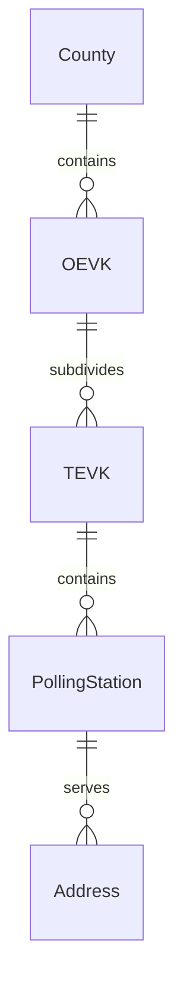
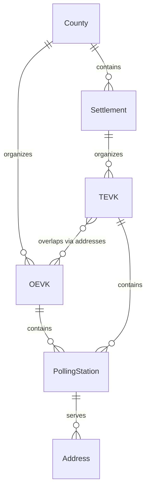

# Design: Fix OEVK/TEVK Hierarchy

## Architecture Overview

This change corrects a fundamental data model error where TEVK (Settlement Electoral Districts) were incorrectly modeled as hierarchically dependent on OEVK (National Electoral Districts). The fix removes this artificial dependency while preserving the correct relationship through the Address table.

## Current Architecture (Incorrect)

```
┌─────────┐
│ County  │
└────┬────┘
     │
     ├─→ ┌────────┐
     │   │  OEVK  │
     │   └───┬────┘
     │       │
     │       └─→ ┌────────┐     ❌ WRONG: TEVK under OEVK
     │           │  TEVK  │
     │           └───┬────┘
     │               │
     └───────────────┴─→ ┌───────────────┐
                         │PollingStation │
                         └───────┬────────┘
                                 │
                              ┌──▼──────┐
                              │ Address │
                              └─────────┘
```

**Problems:**
1. TEVK table has FK to OEVK (wrong relationship)
2. TEVK ID includes OEVK in hash (artificial coupling)
3. TEVK transformation JOINs OEVK (unnecessary dependency)
4. UNIQUE constraint includes OEVK (incorrect)

## Proposed Architecture (Correct)

```
┌─────────┐
│ County  │
└────┬────┘
     │
     ├─→ ┌────────┐
     │   │  OEVK  │────────┐
     │   └────────┘        │
     │                     │
     ├─→ ┌────────────┐    │
     │   │ Settlement │    │
     │   └─────┬──────┘    │
     │         │           │
     │         └─→ ┌────────┐     ✅ CORRECT: TEVK under Settlement
     │             │  TEVK  │
     │             └───┬────┘
     │                 │
     └─────────────────┴────┴─→ ┌───────────────┐
                                │PollingStation │
                                └───────┬────────┘
                                        │
                                     ┌──▼──────┐
                                     │ Address │ (has both TEVK and OEVK FKs)
                                     └─────────┘
```

**Improvements:**
1. TEVK table has NO FK to OEVK (correct model)
2. TEVK ID based on (County, Settlement, TEVK) only
3. TEVK transformation independent of OEVK
4. UNIQUE constraint on (County_ID, Settlement_ID, TEVK)
5. OEVK/TEVK relationship discoverable via Address table

## Data Model Changes

### Entity Relationship Diagram

**Before (Incorrect):**


**After (Correct):**


### Schema Transformation

#### SettlementIndividualElectoralDistrict Table

**Before:**
| Column | Type | Constraint | Purpose |
|--------|------|-----------|---------|
| ID | TEXT | PK | hash(county, settlement, tevk, **oevk**) ❌ |
| TEVK | TEXT | | TEVK code |
| Name | TEXT | NOT NULL | Display name |
| County_ID | TEXT | FK→County | Administrative hierarchy |
| Settlement_ID | TEXT | FK→Settlement | Primary organization axis |
| **NationalIndividualElectoralDistrict_ID** | **TEXT** | **FK→OEVK** | **❌ WRONG RELATIONSHIP** |
| UNIQUE | | (County, Settlement, TEVK, **OEVK**) | ❌ Includes OEVK |

**After:**
| Column | Type | Constraint | Purpose |
|--------|------|-----------|---------|
| ID | TEXT | PK | hash(county, settlement, tevk) ✅ |
| TEVK | TEXT | | TEVK code |
| Name | TEXT | NOT NULL | Display name |
| County_ID | TEXT | FK→County | Administrative hierarchy |
| Settlement_ID | TEXT | FK→Settlement | Primary organization axis |
| UNIQUE | | (County, Settlement, TEVK) | ✅ Correct constraint |

**Changes:**
- ❌ Removed: `NationalIndividualElectoralDistrict_ID` column
- ❌ Removed: FK to NationalIndividualElectoralDistrict
- ✅ Updated: ID generation (removed OEVK component)
- ✅ Updated: UNIQUE constraint (removed OEVK)

#### PollingStation Table (No Change)

**Unchanged** - Correctly maintains both relationships:
| Column | FK | Purpose |
|--------|------|---------|
| SettlementIndividualElectoralDistrict_ID | FK→TEVK | Local district |
| NationalIndividualElectoralDistrict_ID | FK→OEVK | National district |

**Rationale:** Polling stations exist in the context of both electoral systems. Both FKs are correct.

#### Address Table (No Change)

**Unchanged** - Correctly maintains both relationships:
| Column | FK | Purpose |
|--------|------|---------|
| SettlementIndividualElectoralDistrict_ID | FK→TEVK | Local district |
| NationalIndividualElectoralDistrict_ID | FK→OEVK | National district |

**Rationale:** Addresses participate in both electoral systems. Both FKs are correct.

## Hash Function Changes

### Function Signature Evolution

#### Before (Incorrect)
```python
def hash_tevk_id(
    county_code: str, 
    settlement_code: str, 
    tevk: str, 
    oevk: str  # ❌ Artificial dependency
) -> str:
    return hash(f"{county_code}|{settlement_code}|{tevk}|{oevk}")
```

**Problems:**
- OEVK included in hash creates coupling
- Same TEVK in different OEVKs gets different IDs (wrong)
- ID not stable if OEVK boundaries change

#### After (Correct)
```python
def hash_tevk_id(
    county_code: str,
    settlement_code: str,
    tevk: str  # ✅ Independent
) -> str:
    return hash(f"{county_code}|{settlement_code}|{tevk}")
```

**Benefits:**
- TEVK ID independent of OEVK (correct)
- Same TEVK code always generates same ID (stable)
- Reflects real-world: TEVK belongs to settlement, not OEVK

### Call Site Updates

**Files with `hash_tevk_id()` calls:**
1. `src/etl/hashing.py` - Function definition
2. `src/etl/transform_optimized.py`:
   - Line ~50: DuckDB macro definition
   - Line ~354: TEVK table transformation
   - Line ~403: PollingStation transformation
   - Line ~501: Address transformation (original)
   - Line ~748: Address transformation (canonical)
3. `src/etl/transform.py`:
   - Line ~37: DuckDB macro definition
   - Line ~250: TEVK table transformation
   - Line ~296: PollingStation transformation
   - Line ~380: Address transformation

**Update Pattern:**
```python
# Before
hash_tevk_id(county, settlement, tevk, oevk)

# After
hash_tevk_id(county, settlement, tevk)
```

## Transformation Logic Changes

### TEVK Table Creation

#### Before (Incorrect)
```sql
INSERT INTO SettlementIndividualElectoralDistrict (
    ID, TEVK, Name, County_ID, Settlement_ID, 
    NationalIndividualElectoralDistrict_ID  -- ❌ Wrong FK
)
SELECT
    hash_tevk_id(county_code, settlement_code, tevk_code, oevk_code),
    ...
    o.ID as NationalIndividualElectoralDistrict_ID  -- ❌ Wrong assignment
FROM staging_korzet sk
JOIN County c ON ...
JOIN Settlement s ON ...
JOIN NationalIndividualElectoralDistrict o  -- ❌ Unnecessary JOIN
    ON sk.county_code = c.CountyCode 
    AND sk.oevk_code = o.OEVK
GROUP BY ..., o.ID  -- ❌ Includes OEVK in GROUP BY
```

**Problems:**
- JOIN on OEVK creates dependency
- If OEVK JOIN fails, TEVK record not created (data loss)
- GROUP BY includes OEVK (incorrect)
- UNIQUE constraint check includes OEVK (wrong)

#### After (Correct)
```sql
INSERT INTO SettlementIndividualElectoralDistrict (
    ID, TEVK, Name, County_ID, Settlement_ID  -- ✅ No OEVK FK
)
SELECT
    hash_tevk_id(county_code, settlement_code, tevk_code),  -- ✅ No oevk
    sk.tevk_code as TEVK,
    CASE
        WHEN sk.tevk_code IS NOT NULL AND sk.tevk_code != ''
        THEN MAX(sk.settlement_name) || ' ' || sk.tevk_code
        ELSE MAX(sk.settlement_name)
    END as Name,
    c.ID as County_ID,
    s.ID as Settlement_ID
FROM staging_korzet sk
JOIN County c ON sk.county_code = c.CountyCode
JOIN Settlement s 
    ON sk.county_code = c.CountyCode 
    AND sk.settlement_code = s.SettlementCode
WHERE sk.run_tag = ?
GROUP BY sk.county_code, sk.settlement_code, sk.tevk_code, c.ID, s.ID
ON CONFLICT (ID) DO NOTHING
```

**Improvements:**
- No OEVK JOIN (simpler, faster)
- TEVK records created independently
- GROUP BY only on relevant keys
- UNIQUE constraint correctly based on (County, Settlement, TEVK)

### PollingStation Table Creation

#### Update Required
```sql
-- Before
hash_tevk_id(county_code, settlement_code, tevk_code, oevk_code)

-- After  
hash_tevk_id(county_code, settlement_code, tevk_code)
```

**No other changes** - PollingStation still references both TEVK and OEVK (correct)

### Address Table Creation

#### Update Required
```sql
-- Before
hash_tevk_id(county_code, settlement_code, tevk_code, oevk_code)

-- After
hash_tevk_id(county_code, settlement_code, tevk_code)
```

**No other changes** - Address still references both TEVK and OEVK (correct)

## Migration Strategy

### Why No In-Place Migration?

**Reason:** This is a **logical model correction**, not a data migration. The old model is fundamentally wrong.

**Implications:**
- TEVK IDs change (OEVK removed from hash)
- Schema incompatible (column removed)
- Cannot preserve old IDs (they were based on wrong model)
- Must regenerate all data

### Migration Steps

**Step 1: Backup Current Data**
```bash
# Backup current database
cp data/oevk.db data/oevk_backup_$(date +%Y%m%d).db

# Backup current exports
tar -czf exports_backup_$(date +%Y%m%d).tar.gz exports/
```

**Step 2: Apply Schema Changes**
```sql
-- Drop dependent tables in correct order
DROP TABLE IF EXISTS Address;
DROP TABLE IF EXISTS PollingStation;
DROP TABLE IF EXISTS SettlementIndividualElectoralDistrict;

-- Recreate with new schema (from updated schema.sql)
-- Schema applied automatically by pipeline
```

**Step 3: Re-run Transformation Pipeline**
```bash
python src/cli.py run --run-tag $(date +%Y%m%d-%H%M)
```

**Step 4: Validate Results**
```sql
-- Verify TEVK table has no OEVK FK
PRAGMA foreign_key_list(SettlementIndividualElectoralDistrict);

-- Verify TEVK count matches expected
SELECT COUNT(*) FROM SettlementIndividualElectoralDistrict;
-- Expected: ~4,677 TEVKs

-- Verify some TEVKs span multiple OEVKs
SELECT t.Settlement_ID, t.TEVK, 
       COUNT(DISTINCT a.NationalIndividualElectoralDistrict_ID) as oevk_count
FROM SettlementIndividualElectoralDistrict t
JOIN Address a ON a.SettlementIndividualElectoralDistrict_ID = t.ID
GROUP BY t.Settlement_ID, t.TEVK
HAVING COUNT(DISTINCT a.NationalIndividualElectoralDistrict_ID) > 1;
-- If returns rows: proves TEVK/OEVK independence (success)
```

**Step 5: Regenerate Exports**
```bash
# CSV export
python src/cli.py run --stages export

# PostgreSQL export
python src/cli.py run --stages export
```

**Step 6: Update Downstream Systems**
- Notify consumers of TEVK ID changes
- Update any hardcoded TEVK IDs
- Update any queries assuming TEVK→OEVK FK

### Rollback Plan

**If issues found during validation:**
```bash
# Restore backup database
cp data/oevk_backup_YYYYMMDD.db data/oevk.db

# Restore backup exports
tar -xzf exports_backup_YYYYMMDD.tar.gz

# Revert code changes
git revert <commit-sha>
```

**Note:** Rollback returns to incorrect model. Fix should be validated thoroughly before production deployment.

## Testing Strategy

### Contract Tests

**New Test:** Verify TEVK independence from OEVK
```python
def test_tevk_id_independent_of_oevk():
    """TEVK IDs must not depend on OEVK."""
    # Same TEVK in different OEVKs should have same ID
    id1 = hash_tevk_id("01", "001", "1")  # No oevk parameter
    id2 = hash_tevk_id("01", "001", "1")
    assert id1 == id2
    
def test_tevk_table_has_no_oevk_fk():
    """TEVK table must not have FK to OEVK."""
    conn = get_test_connection()
    fks = conn.execute("""
        PRAGMA foreign_key_list(SettlementIndividualElectoralDistrict)
    """).fetchall()
    
    # Should have FKs to County and Settlement only
    fk_tables = [fk[2] for fk in fks]
    assert "County" in fk_tables
    assert "Settlement" in fk_tables
    assert "NationalIndividualElectoralDistrict" not in fk_tables
```

### Integration Tests

**Update Test:** TEVK transformation
```python
def test_tevk_transformation_creates_independent_records():
    """TEVKs must be created without OEVK dependency."""
    conn = create_test_db()
    load_test_staging_data(conn)
    
    transform_settlement_individual_electoral_districts(conn, "test")
    
    tevks = conn.execute("""
        SELECT COUNT(*) FROM SettlementIndividualElectoralDistrict
    """).fetchone()[0]
    
    assert tevks > 0  # TEVKs created
    
    # Verify TEVK ID format (should not include OEVK)
    sample_id = conn.execute("""
        SELECT ID FROM SettlementIndividualElectoralDistrict LIMIT 1
    """).fetchone()[0]
    
    # TEVK ID should be hash of (county, settlement, tevk) only
    assert len(sample_id) == 16  # xxhash64 hex length
```

**New Test:** Verify TEVK/OEVK independence
```python
def test_tevk_can_span_multiple_oevks():
    """Verify TEVK can span multiple OEVKs (proves independence)."""
    conn = create_test_db()
    load_real_sample_data(conn)  # Use real data sample
    
    result = conn.execute("""
        SELECT t.TEVK, 
               COUNT(DISTINCT a.NationalIndividualElectoralDistrict_ID) as oevk_count
        FROM SettlementIndividualElectoralDistrict t
        JOIN Address a ON a.SettlementIndividualElectoralDistrict_ID = t.ID
        GROUP BY t.TEVK
        HAVING COUNT(DISTINCT a.NationalIndividualElectoralDistrict_ID) > 1
    """).fetchall()
    
    # If any TEVK spans multiple OEVKs, independence is proven
    # This may or may not return rows depending on real-world data
    # Either outcome is valid as long as model allows it
```

### Data Integrity Tests

**Schema Validation:**
```python
def test_schema_integrity_after_migration():
    """Verify schema integrity after TEVK model fix."""
    conn = get_database_connection()
    
    # Check TEVK table structure
    tevk_schema = conn.execute("""
        PRAGMA table_info(SettlementIndividualElectoralDistrict)
    """).fetchall()
    
    tevk_columns = {col[1] for col in tevk_schema}
    assert "ID" in tevk_columns
    assert "TEVK" in tevk_columns
    assert "County_ID" in tevk_columns
    assert "Settlement_ID" in tevk_columns
    assert "NationalIndividualElectoralDistrict_ID" not in tevk_columns  # KEY CHECK
    
    # Check UNIQUE constraint
    indices = conn.execute("""
        PRAGMA index_list(SettlementIndividualElectoralDistrict)
    """).fetchall()
    # Verify UNIQUE constraint exists and doesn't include OEVK
```

## Performance Considerations

### Expected Performance Impact

**Positive:**
- One less JOIN in TEVK transformation (~5% faster)
- One less column in TEVK table (~2% smaller)
- Simpler hash computation (~1% faster)

**Neutral:**
- Same number of tables
- Same overall data volume
- Same export size (OEVK still in Address/PollingStation)

**Overall:** Minimal to slightly positive performance impact

### Query Performance

**Before (with FK):**
```sql
-- Direct JOIN possible but wrong
SELECT * FROM TEVK t
JOIN OEVK o ON t.NationalIndividualElectoralDistrict_ID = o.ID;
-- Fast but incorrect
```

**After (no FK):**
```sql
-- Must join via Address
SELECT DISTINCT o.* FROM TEVK t
JOIN Address a ON a.SettlementIndividualElectoralDistrict_ID = t.ID
JOIN OEVK o ON a.NationalIndividualElectoralDistrict_ID = o.ID;
-- Slightly slower but correct
```

**Mitigation:** Add index on `Address.SettlementIndividualElectoralDistrict_ID` (already exists)

## Risks and Mitigations

### Risk 1: Breaking Downstream Systems
**Impact:** HIGH  
**Probability:** MEDIUM  
**Mitigation:**
- Document breaking changes clearly
- Provide migration guide for consumers
- Update all internal queries before release
- Test with sample downstream integrations

### Risk 2: Data Loss During Migration
**Impact:** HIGH  
**Probability:** LOW  
**Mitigation:**
- Backup database before migration
- Backup exports before regeneration
- Test migration on copy first
- Validate row counts match expectations

### Risk 3: Incorrect Validation (Missing Edge Cases)
**Impact:** MEDIUM  
**Probability:** LOW  
**Mitigation:**
- Use real data samples for testing
- Manual inspection of sample TEVKs
- Cross-reference with official electoral data
- Geographic boundary validation (if available)

### Risk 4: Performance Regression
**Impact:** LOW  
**Probability:** LOW  
**Mitigation:**
- Benchmark before/after
- Monitor pipeline execution time
- Verify memory usage stable
- Index optimization if needed

## Success Metrics

**Code Quality:**
- ✅ All tests pass
- ✅ No ruff/mypy errors
- ✅ Code coverage maintained

**Data Integrity:**
- ✅ TEVK count matches expected (~4,677)
- ✅ No orphaned records
- ✅ All foreign keys valid
- ✅ UNIQUE constraints enforced

**Performance:**
- ✅ Pipeline completes within NFR-002 limit (30 min)
- ✅ Memory usage stable
- ✅ Export generation time unchanged

**Correctness:**
- ✅ TEVK table has no OEVK FK
- ✅ TEVK IDs deterministic without OEVK
- ✅ Documentation reflects correct model
- ✅ Queries updated to use correct patterns

## Future Considerations

### Potential Enhancements

**Geographic Boundary Data:**
- If TEVK boundary polygons become available, add to TEVK table
- Similar to OEVK.Polygon field (already implemented)
- Would enable geospatial queries on TEVK boundaries

**Many-to-Many Discovery:**
- Create materialized view of TEVK-OEVK overlaps
- Useful for electoral analysis
- Example: `CREATE VIEW TEVK_OEVK_Overlaps AS SELECT ...`

**Historical Tracking:**
- If electoral boundaries change over time
- Add version/date columns
- Maintain historical TEVK-OEVK mappings

### Lessons Learned

**Root Cause:**
- Source data co-location (both codes in same CSV) led to assumption of hierarchy
- Insufficient domain knowledge verification during initial design
- Missing validation against real-world electoral geography

**Prevention:**
- Validate data model against domain experts
- Document assumptions explicitly
- Test with edge cases that prove/disprove relationships
- Cross-reference with authoritative sources (electoral law)

---

**Design Review:** Pending  
**Architecture Approval:** Required  
**Risk Assessment:** Medium (breaking change, requires data regeneration)
